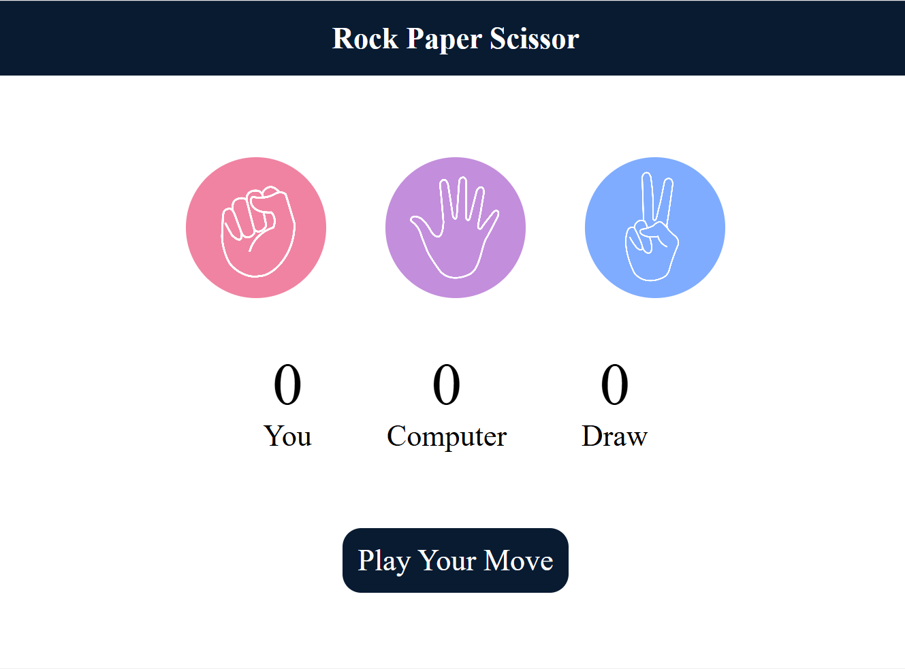
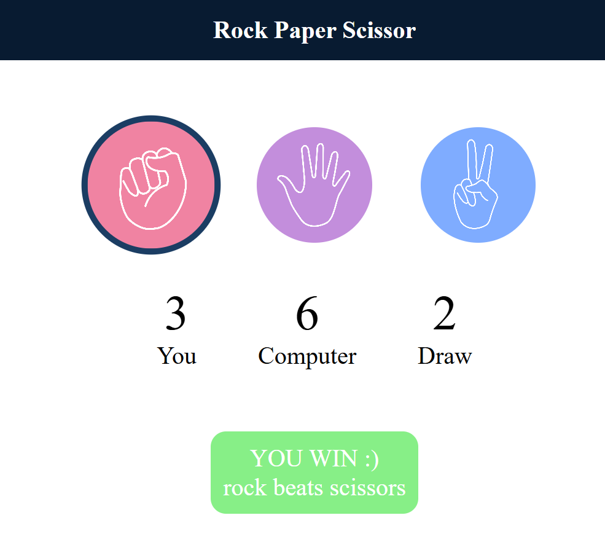
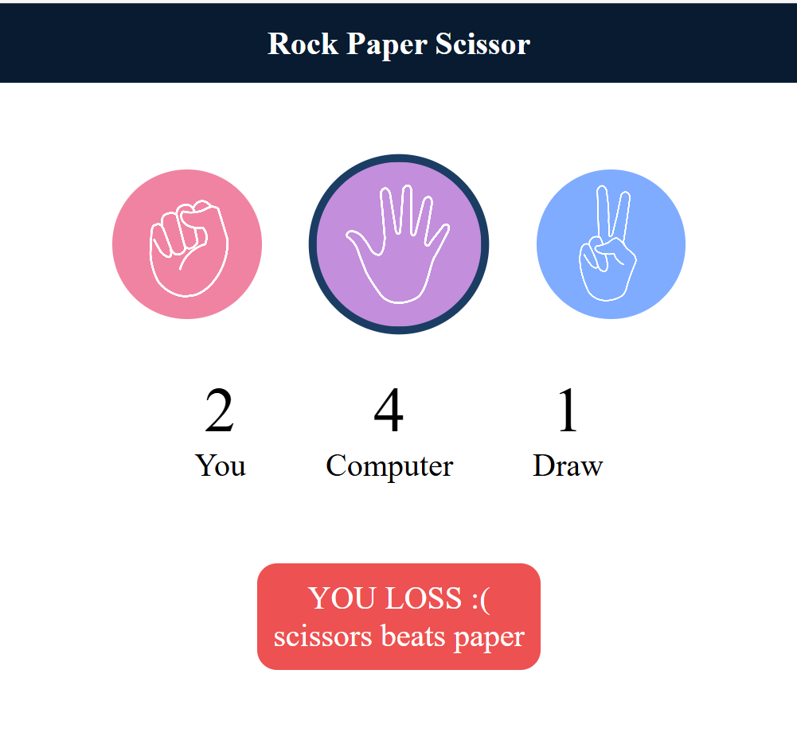
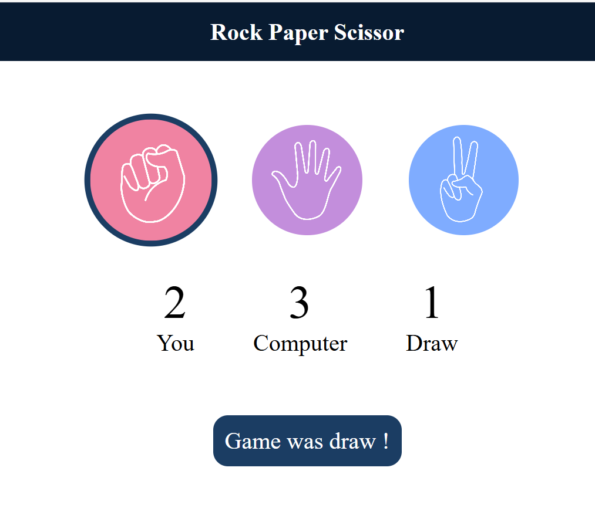

# 🪨 Rock Paper Scissors Game 🎮

A simple and interactive **Rock Paper Scissors** game built using **HTML, CSS, and JavaScript**. The user plays against the computer, and the scores are tracked dynamically.

## 🚀 Features

- 🎮 Play against the computer
- 📈 Real-time score tracking (You, Computer, and Draws)
- ✨ Hover effects and smooth animations
- 🎨 Stylish UI with responsive layout
- 📱 Works on all modern browsers

### 📷 Screenshots

### 📌 Game Start Screen

### 🎮 Gameplay Example

## 🛠️ Tech Stack

- HTML5
- CSS3
- JavaScript (Vanilla)

## 📂 Project Structure
Rock_Paper_Scissor/
├── index.html
├── style.css
├── script.js
└── img/
    ├── rock.png
    ├── paper.png
    ├── scissors.png
    ├── startScreen.png
    ├── win.png
    ├── loss.png
    └── draw.png
